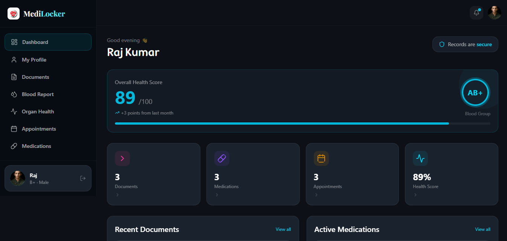

# 🏥 MediLocker

> A modern and secure healthcare management dashboard built with React, Tailwind CSS, and interactive UI components.


---

## ✨ Overview

MediLocker helps users manage and track their healthcare records in one place.  
The platform provides an elegant dashboard for monitoring health data, appointments, medications, documents, and organ health information.

---

## 🚀 Features

### 📄 Smart Document Management
- Upload and manage prescriptions, reports, and medical documents
- Organized document dashboard
- Easy access to records

### 💊 Medication Tracking
- View active medications
- Track dosage and schedules
- Medicine reminders interface

### 📅 Appointment Management
- Add new appointments dynamically
- Upcoming & completed appointment tracking
- Interactive appointment cards

### ❤️ Organ Health Information
- Learn about important body organs
- Educational health content
- Interactive organ cards

### 📊 Health Dashboard
- Overall health score
- Blood group display
- Recent records and activity monitoring


---

## 🖼️ Project Preview

### Dashboard UI



---


# 🛠️ Tech Stack

## Frontend
- React.js (Vite)
- Tailwind CSS
- recharts
- Lucide React
- Swiper.js
- Lucide React
- React Feather

## Backend
- Node.js
- Express.js

## Database
- MongoDB

## Cloud Services
- Cloudinary


---

# 📂 Project Structure

```bash
MediLocker/
│
├── Frontend/
│   ├── src/
│     ├── Components/
│     ├── Pages/
│     ├── assets/
│     └── ...
│
├── Backend/
|   ├──src
│     ├── Controllers/
│     ├── Routes/
│     ├── Models/
│     ├── Middleware/
│     └── ...
│
└── README.md
```


## 1️⃣ Clone the Repository

```bash
git clone https://github.com/vishalkumar2024/MediLocker.git
```

---

## 2️⃣ Navigate to Project Directory

```bash
cd medilocker
```

---

## 3️⃣ Install Frontend Dependencies

```bash
cd Frontend
npm install
```

---

## 4️⃣ Install Backend Dependencies

```bash
cd Backend
npm install
```

---

# 🔑 Environment Variables

Create a `.env` file inside the backend folder and add:

```env
PORT=5000
MONGO_URI=your_mongodb_connection
JWT_SECRET=your_secret_key
CLOUDINARY_CLOUD_NAME=your_cloud_name
CLOUDINARY_API_KEY=your_api_key
CLOUDINARY_API_SECRET=your_api_secret
```

---

# ▶️ Run the Project

## Start Backend

```bash
cd Back-end
npm run dev
```

## Start Frontend

```bash
cd Frontend
npm run dev
```

---

## 📱 Responsive Design

MediLocker is fully responsive and optimized for:

- 💻 Desktop
- 📱 Mobile
- 📟 Tablet


## 👨‍💻 Author


👨‍💻 Vishal Kumar Soni

- GitHub: :https://github.com/vishal-kumar-soni
- LinkedIn:https://www.linkedin.com/in/vishal-kumar-soni-/
- Email: vkumarsoni30@gmail.com


---

## 📜 License

This project is licensed under the MIT License.

---

# ⭐ If you like this project, give it a star on GitHub!